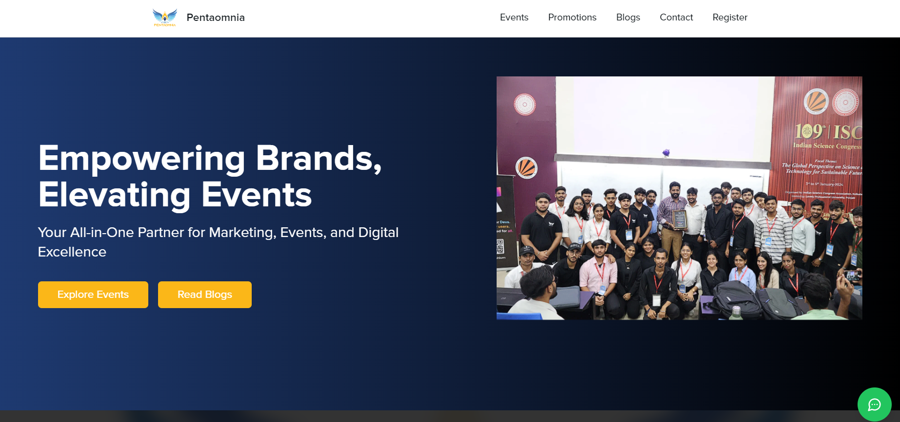

[node]: https://nodejs.org/en
[browserslist]: https://browsersl.ist/#q=last+3+versions%2C%3E+0.2%25%2C+not+dead
[chrome-icon]: https://github.com/alrra/browser-logos/blob/main/src/chrome/chrome_64x64.png
[firefox-icon]: https://github.com/alrra/browser-logos/blob/main/src/firefox/firefox_64x64.png
[edge-icon]: https://github.com/alrra/browser-logos/blob/main/src/edge/edge_64x64.png
[opera-icon]: https://github.com/alrra/browser-logos/blob/main/src/opera/opera_64x64.png
[safari-icon]: https://github.com/alrra/browser-logos/blob/main/src/safari/safari_64x64.png

# Pentaomnia.com

This website was created for the Bihar-based startup Pentaomnia.com. It leverages modern web technologies such as **Next.js**, **React**, **TypeScript**, **shadcn/ui**, **TailwindCSS**, and **SASS** to deliver a robust and scalable web application.

---

## :bookmark: Table of contents

- :computer: [Getting started](#computer-getting-started "Go to 'Getting started' section")
- :battery: [Features](#battery-features "Go to 'Features' section")
- :camera: [Preview](#camera-preview "Go to 'Preview' section")
- :lock: [License](#lock-license "Go to 'License' section")

---

## :computer: Getting started

### Prerequisites:

- JavaScript runtime **[node.js][node]**;
- Package manager **npm** or **yarn**;

### Start developing:

- Get the repository:
  - click **"Use this template"** &nbsp; or &nbsp; **"Fork"** button <br /> alternately
  - **clone** the repository through your terminal
- Open your terminal or code editor to the path your project is located, and run:
    
    ```bash
    # Install the dependencies
    npm install
    
    # Start the development server
    npm run dev
    ```

---

## :battery: Features

This repository comes 🔋 packed with:

- **Next.js**;
- **React**;
- **TypeScript**;
- **shadcn/ui**;
- **TailwindCSS**;
- **SASS** & **SCSS**;
- **ESLint**;
- **Prettier**;
- **Husky**;
- **Lint staged**;

---

## Preview


Url: https://pentaomnia.com
---

## :lock: License

This website is not available for open source. Copying or redistributing this code is strictly illegal.

[Back to :arrow_up:](#pentaomniacom "Back to 'Table of contents' section")